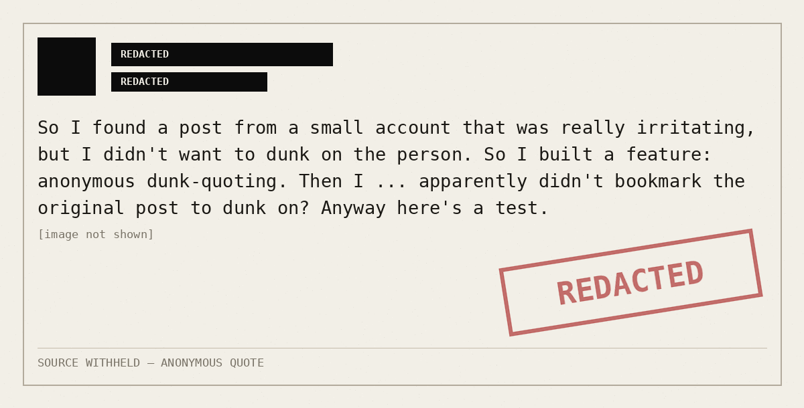

# dunking-anonymously

Renders a Bluesky post as an anonymised screenshot, so the words can be quoted
without the handle. A quote-post delivers your whole audience to the original
author; for an account with forty followers that is a pile-on whatever your
caption said.

Idea from [Luis Villa](https://bsky.app/profile/lu.is/post/3mv6ynbcjr62b), who
built the same feature for himself. His render greys the identity out; this one
blacks it out, declassified-document styling.



## Usage

```bash
python3 scripts/dunk.py https://bsky.app/profile/someone.bsky.social/post/3mv6...
python3 scripts/dunk.py at://did:plc:xxxx/app.bsky.feed.post/3mv6... --stamp
python3 scripts/dunk.py someone.bsky.social/3mv6... --redact "my town" --show-date
```

Writes `<rkey>.png` to the working directory, prints the alt text to stdout, and
writes `<rkey>.json` holding the source URI for your own records. The source URI
stays out of both the image and the alt text.

| flag | effect |
|---|---|
| `--redact "phrase"` | blacks out a literal phrase, repeatable |
| `--stamp` | adds the rotated REDACTED stamp |
| `--show-date` | prints the post date in the footer |
| `--out PATH` | output path |
| `--width N` | image width, default 1200 |

## Redactions applied

Avatar, display name and handle become black bars. Every at-mention facet in the
body is blacked out, since a mention is a second person's handle and a strong
search key for finding the original. Embedded images, video, link cards and
quoted posts render as `[image not shown]` and friends rather than being
fetched, because an embedded image can carry a face, a location or a watermark.
Engagement counts are dropped, and the date is dropped unless `--show-date` —
a date plus one distinctive sentence narrows a search to a single post.

It cannot redact identity out of the post's own words. Bluesky indexes full post
text, so a post naming its author's employer, town or cat stays traceable by
anyone who pastes a sentence into search. `--redact` is the only defence, and it
is manual, which is why reading the rendered PNG is part of the procedure rather
than a nicety.

## Network

Unauthenticated. It needs no token and leaves nothing in anyone's notifications.

- `public.api.bsky.app` — `app.bsky.feed.getPostThread`, tried first
- `api.bsky.app` — same lexicon, used when the first host answers 403

The fallback exists because `public.api.bsky.app` returns 403 from some proxied
environments while `api.bsky.app` answers normally. Both returned 200 from the
Claude.ai container on 2026-09-10. A `User-Agent` header is sent on every
request; some AppView deployments refuse urllib's default.

The script never fetches `cdn.bsky.app`, so no image blob of the original
account is retrieved.

## Dependencies

Pillow and the standard library. DejaVu Sans Mono at
`/usr/share/fonts/truetype/dejavu`, which ships with the container.

```bash
pip install --break-system-packages pillow   # only if Pillow is absent
```

## Scope

Quote-post public figures and large accounts normally — anonymising a senator
removes the reader's ability to check the source while protecting nobody. See
the When NOT to use section of [SKILL.md](SKILL.md) for the routing table, the
earned exceptions, and the condition for abandoning a render mid-run.
